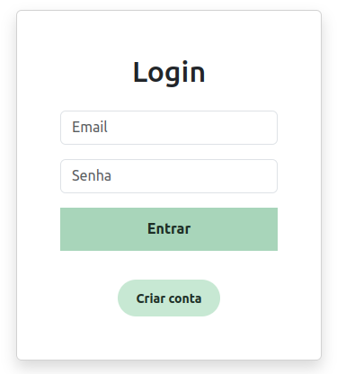
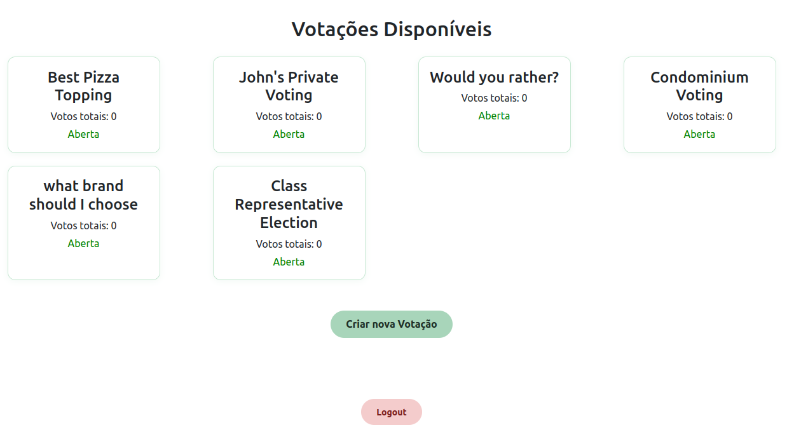
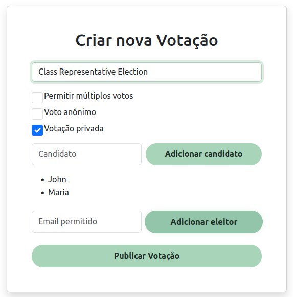
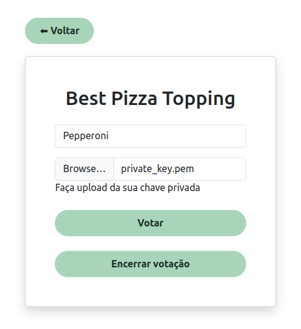
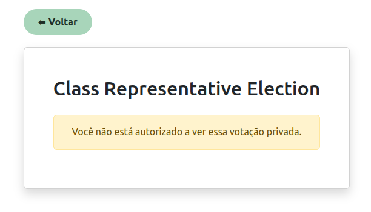
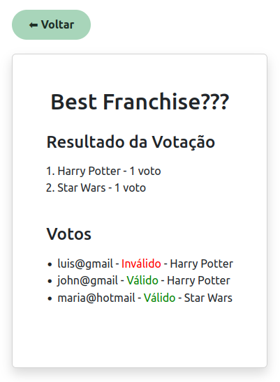

# Secure Digital Voting using RSA and JWT

Repository for a web-based digital voting platform where each vote is signed with the voter's private RSA key and verified by the server using the corresponding public key. Authentication is handled via JWT tokens stored in secure browser cookies.

## 🚀 Features

* ✅ **User authentication with JWT tokens**
* 🔐 **RSA-based digital vote signing and verification**
* 🧾 **Support for anonymous and named voting**
* 👥 **Private votings with email-based whitelisting**
* 🔁 **Optional multiple votes per user**
* 📦 **Vote validation on tallying (valid/invalid signatures)**
* 📊 **Web interface for managing and viewing votings**

## 🛡️ Security Highlights

* 🔑 JWT tokens with expiration and JTI for replay protection
* 📜 RSA-2048 with SHA-256 and PKCS#1 v1.5 padding
* 🕵️ HTTPS support and `httponly` cookie for session safety
* 📁 Private keys are never stored on the server — only public keys are
* ❌ Votes with invalid or missing signatures are rejected at the tallying
* 🚪 Secure logout that clears the JWT cookie, adds the JTI to a blacklist and ends the session

## 🛠️ Technologies Used

- Python 3.x
- Flask
- PyJWT
- Cryptography
- Bcrypt
- OpenSSL
- SQLite

## 🏁 Getting Started

1. Clone the repository:
    ```bash
    git clone https://github.com/fornari03/secure-digital-voting-rsa.git
    cd secure-digital-voting-rsa
    ```

2. Setup the environment:
    ```bash
    chmod +x setup.sh
    ./setup.sh
    source env/bin/activate
    ```

### Running the Application

```bash
python main.py
```

The server will start on `https://127.0.0.1:5000`.

## 🖥️ UI Preview

### Login



### Voting List and Create Voting





### Voting Info and Unauthorized User in Private Voting





### Voting Tallying



### 🧑‍💻 Authentication

* Users must log in to receive a JWT token.
* The token is stored as a secure, HTTP-only cookie in the user's browser.

### 🗳️ Voting Process

1. Log in and obtain a valid JWT token.
2. Select a voting from the dashboard.
3. Choose an option and upload your private RSA key to sign the vote.

### ✅ Vote Tallying

* When the voting is closed:

  * The system verifies all signatures.
  * Only votes with valid digital signatures and authenticated users are counted.
  * Invalid or duplicated votes (if not allowed) are discarded.

## 🔗 Example API Endpoints

| Method | Endpoint                  | Description                             |
| ------ | ------------------------- | --------------------------------------- |
| POST   | `/login`                  | Authenticate user and receive JWT token |
| POST   | `/register`               | Register new user and generate RSA keys |
| GET    | `/voting_list`            | Display all votings (open and closed)   |
| GET    | `/voting_info/<id>`       | View specific voting and submit a vote  |
| POST   | `/voting_info/<id>`       | Submit signed vote (JWT required)       |
| POST   | `/voting_info/<id>/close` | Close a voting (if user has permission) |


## 📝 License

This project is licensed under the MIT License.
